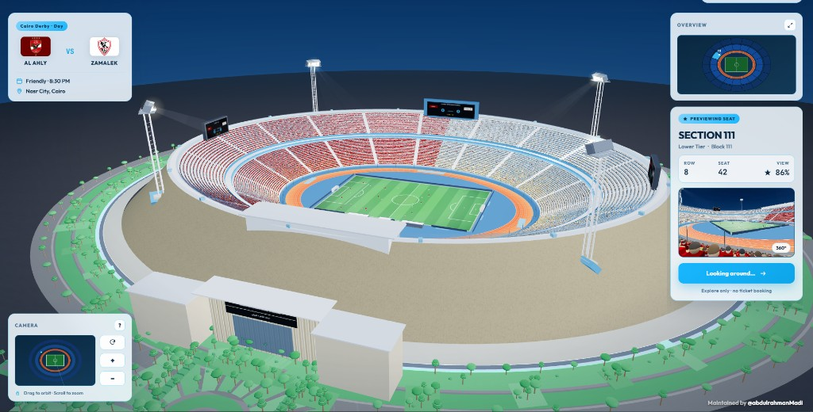
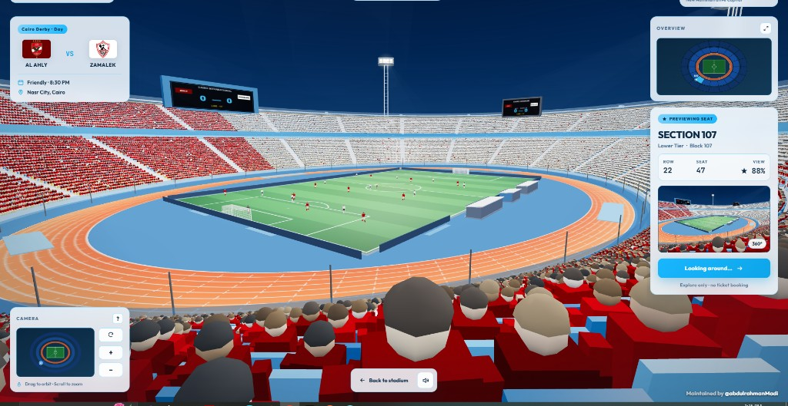
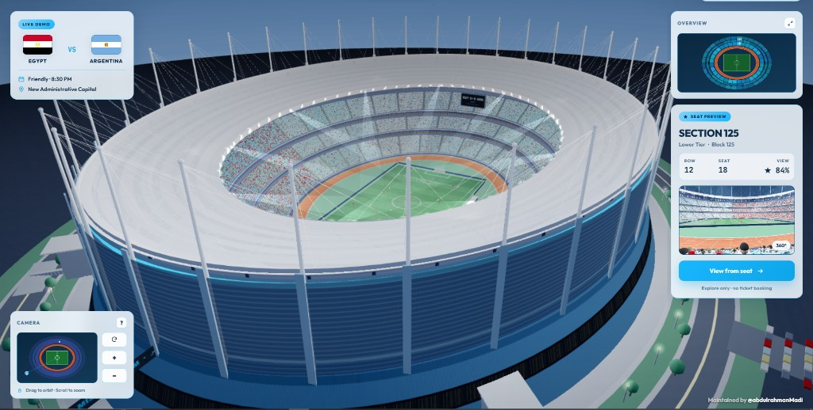
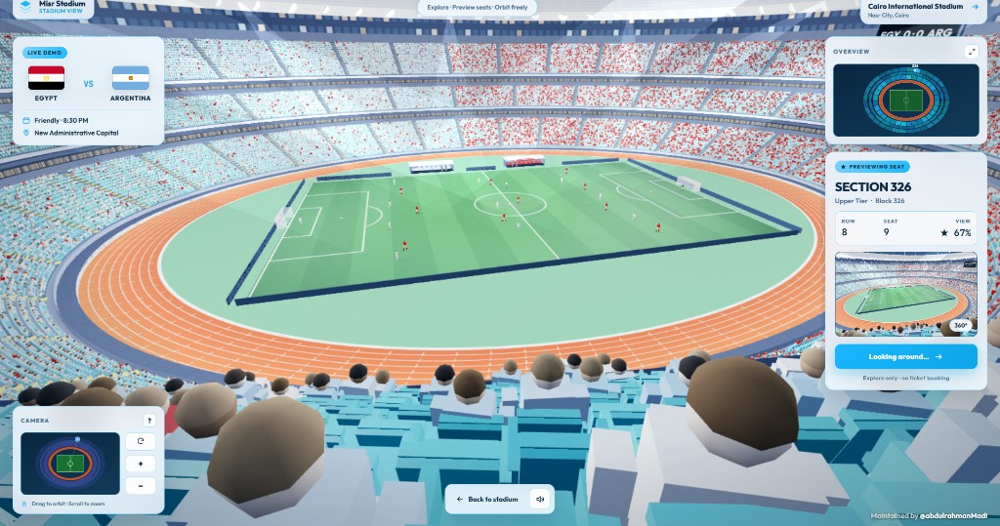

# Egypt Stadiums 3D

An interactive 3D experience for exploring Egyptian football stadiums from the
air, around the bowl, and directly from the supporters' seats.

[](https://angular.dev/)
[](https://threejs.org/)
[](https://www.typescriptlang.org/)
[](LICENSE)

## [Open the live experience](https://egypt-stadiums-3d.vercel.app/)

Built with Angular, Three.js, and GSAP. The experience includes two procedural
stadiums, selectable seats, first-person previews, animated crowds, stadium
audio, and a continuous passing match.

Maintained by [Abdulrahman Madi](https://github.com/abdulrahmanMadi).

## Screenshots

### Cairo International Stadium

<p align="center">
  
</p>

<p align="center">
  
</p>

### New Administrative Capital Stadium

<p align="center">
  
</p>

<p align="center">
  
</p>

## Stadiums

### Cairo International Stadium

- Detailed oval bowl inspired by Cairo International Stadium.
- Red-and-white supporter sections for the Cairo derby presentation.
- Running track, dark-blue pitch apron, tunnels, dugouts, floodlights, screens,
  exterior roads, trees, entrances, and surrounding structures.
- Al Ahly versus Zamalek match presentation.
- Orbit and supporter-seat audio mixes designed for different viewpoints.

### New Administrative Capital Stadium

- Multi-tier procedural stadium inspired by Egypt's New Administrative Capital.
- Large exterior shell, structural columns, roof supports, lighting, roads, and
  landscaped surroundings.
- Egypt versus Argentina exhibition presentation.
- Thousands of generated seats with selectable sections and spectator views.
- Accessible at `/stadium/NewAdministrativeCapital`.

## Main features

### Interactive stadium exploration

- Drag to orbit around the active stadium.
- Mouse-wheel and touch zoom controls.
- Reset, zoom-in, and zoom-out camera controls.
- Live camera minimap and stadium overview.
- Arrow-key orbiting, `+`/`-` zoom, `[`/`]` seat selection, `Enter` to open a
  seat, and `Escape` to return.
- Fullscreen mode for a more immersive view.
- Responsive interface for desktop and mobile layouts.

### Seat selection and first-person preview

- Thousands of procedurally positioned seats.
- GPU-based seat picking for responsive hover and click detection.
- Section, tier, block, row, seat, and view-rating information.
- Animated camera transition from orbit mode into the selected seat.
- First-person look controls with subtle spectator head movement.
- Generated thumbnail preview for the selected viewpoint.
- Quick return from seat mode to the full stadium.

### Animated match simulation

- Two animated teams, goalkeepers, referee, ball, and technical-area staff.
- Role-based positioning for defenders, midfielders, and forwards.
- Players can cross the halfway line naturally according to the team shape.
- Passing-focused build-up from defense through midfield into attack.
- Automatic possession turnover after passing sequences.
- Defensive interception when a forward reaches a dangerous position.
- Pass-only exhibition behavior with no goal-scoring loop.

### Stadium atmosphere

- Animated supporters generated with efficient instanced meshes.
- Different supporter colors and seating patterns for each venue.
- Crowd ambience in orbit mode.
- Louder chants, cheers, and reactions in spectator-seat mode.
- Animated scoreboards, LED displays, floodlights, flags, and match presentation.

### Performance and loading

- Each stadium engine is a separate lazy-loaded JavaScript chunk.
- Only the selected stadium scene is created and rendered.
- Switching stadiums disposes the previous WebGL scene, audio, timers, and GPU
  resources before starting the next venue.
- Adaptive rendering quality and capped device pixel ratios.
- Automatic FPS-based quality control plus Low, Medium, High, and Ultra presets.
- Day/night lighting with clear, fog, and rain weather modes.
- Throttled minimap and overview rendering.
- Lazy audio initialization after user interaction.
- Installable PWA with offline application-shell caching.
- Shareable URLs for individual sections, rows, and seats.
- No backend, account, API key, or environment secret is required.

## Routes

- `/` — stadium selection landing page.
- `/stadium/cairo` — Cairo International Stadium.
- `/stadium/NewAdministrativeCapital` — New Administrative Capital Stadium.
- Seat links use `?section=125&row=12&seat=18&view=1`.
- The stadium switcher in the top navigation moves between both venues.

## Technology

- Angular 22 and Angular Router
- TypeScript 6
- Three.js r128 and WebGL
- GSAP 3
- Web Audio API
- HTML Canvas for minimaps and generated previews

## Quick start

Requirements:

- Node.js 22.22.3 or newer
- npm 11 or newer
- A modern browser with WebGL enabled

```bash
git clone https://github.com/abdulrahmanMadi/Egypt-Stadiums-3d.git
cd Egypt-Stadiums-3d/football-stadium-main
npm ci
npm start
```

Open `http://localhost:4200`.

## Production build

```bash
cd football-stadium-main
npm ci
npm run build
```

The browser build is generated in:

```text
football-stadium-main/dist/football-stadium/browser/
```

## Vercel deployment

Deployment commands are defined in the repository-level
[`vercel.json`](vercel.json). In Vercel:

- Leave **Root Directory** empty so it uses the repository root.
- Do not override the install, build, or output commands.
- Set **Node.js Version** to 22.x.

The configuration installs dependencies inside `football-stadium-main`, runs
the Angular production build, publishes `dist/football-stadium/browser`, and
rewrites application routes to `index.html`.

## Project structure

```text
Egypt-Stadiums-3d/
├── .github/                         CI and dependency automation
├── README.md                        Repository documentation
└── football-stadium-main/
    ├── public/
    │   ├── flags/                   Team and country flags
    │   ├── previews/                README and stadium preview images
    │   └── sounds/                  Crowd ambience and reactions
    └── src/
        └── app/
            ├── stadium-page.*       Shared stadium interface
            └── stadium/
                ├── registry.js      Lazy stadium catalog and routes
                ├── stadium.engine.js
                ├── shared/
                │   └── match-play.js
                └── stadiums/
                    ├── cairo.engine.js
                    └── misr.engine.js
```

## Contributing and security

Read [CONTRIBUTING.md](CONTRIBUTING.md) before submitting a pull request.
Report vulnerabilities according to [SECURITY.md](SECURITY.md), not through a
public issue.

## Attribution

This repository is a modified and expanded derivative of
[StadiView by thebuggeddev](https://github.com/thebuggeddev/football-stadium).
The Angular architecture, additional stadium work, presentation, gameplay
changes, and other modifications are maintained by
[Abdulrahman Madi](https://github.com/abdulrahmanMadi).

Original and modification copyright notices are preserved in [LICENSE](LICENSE).
Third-party materials are documented in
[THIRD_PARTY_NOTICES.md](THIRD_PARTY_NOTICES.md).

## License

The project is distributed under the
[PolyForm Noncommercial License 1.0.0](LICENSE).

You may download, study, modify, and share the project for permitted
noncommercial purposes while preserving the license and required notices.
Commercial use, paid access, advertising use, client work, or other
money-generating activity is not granted by this repository.

This is source-available software, not OSI-approved open-source software.
