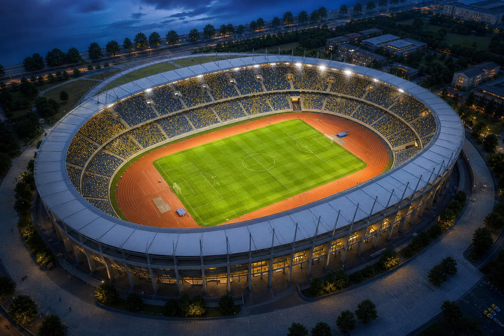

# Egypt Stadiums 3D

An interactive, procedural 3D football-stadium experience built with Angular,
Three.js, and GSAP. Explore Misr Stadium and Cairo International Stadium,
orbit around each venue, preview seats, and watch an animated passing match.

This repository is a modified and expanded derivative of
[StadiView by thebuggeddev](https://github.com/thebuggeddev/football-stadium).
The Angular architecture, additional stadium, visuals, gameplay changes, and
other modifications in this repository are maintained by
[Abdulrahman Madi](https://github.com/abdulrahmanMadi).

[](https://angular.dev/)
[](https://threejs.org/)
[](LICENSE)




## Features

- Two detailed procedural stadiums: Misr and Cairo International.
- Free orbit, zoom, camera overview, and spectator seat views.
- Thousands of generated seats and animated supporters.
- Animated football players with formation-based positioning and passing.
- Stadium ambience, crowd reactions, scoreboards, floodlights, and surroundings.
- Responsive desktop and mobile controls.
- No external API, backend, account, or secret configuration required.

## Technology

- Angular 22
- Three.js r128
- GSAP 3
- TypeScript 6

## Run locally

Requirements:

- Node.js 22.22.3 or newer
- npm 11 or newer

```bash
git clone https://github.com/abdulrahmanMadi/Egypt-Stadiums-3d.git
cd Egypt-Stadiums-3d/football-stadium-main
npm install
npm start
```

Open the address printed by Angular CLI, normally
`http://localhost:4200`.

## Production build

```bash
npm run build
```

Angular writes the production output to `dist/`.

## Controls

- Drag to rotate around the stadium.
- Use the mouse wheel or touch gesture to zoom.
- Click a seat to enter spectator view.
- Drag while seated to look around.
- Press `Esc` or use **Back to stadium** to leave seat view.
- Use the stadium button in the top navigation to switch venues.

## Project structure

```text
src/app/stadium/
├── registry.js              Stadium catalog
├── stadium.engine.js        Stadium lifecycle and switching
├── shared/match-play.js     Shared match simulation
└── stadiums/
    ├── misr.engine.js
    └── cairo.engine.js

public/
├── flags/
├── previews/
└── sounds/
```

The Angular application is the maintained version under `src/`. The root
`index.html` single-file demo and `legacy-vite/` directory are retained as
historical references only.

## License

Original StadiView copyright © 2026
[thebuggeddev](https://github.com/thebuggeddev). Modifications copyright ©
2026 [Abdulrahman Madi](https://github.com/abdulrahmanMadi).

The original project and this derivative are distributed under the
[PolyForm Noncommercial License 1.0.0](LICENSE).

You may download, study, modify, and redistribute the project for personal,
educational, research, hobby, charitable, and other noncommercial purposes,
provided the license and required copyright notice remain included.

You may **not** use this project or modified versions to generate revenue,
sell a product or service, provide paid access, run advertising, or support
another commercial activity without separate written permission from the
copyright owner.

This is source-available software, not OSI-approved open-source software.
No commercial rights are granted by this repository. Commercial use would
require separate permission from every relevant copyright holder.

Third-party assets retain their own terms. See
[THIRD_PARTY_NOTICES.md](THIRD_PARTY_NOTICES.md).
